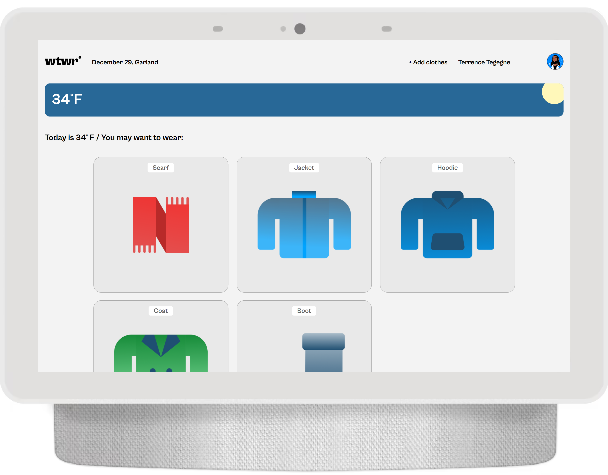
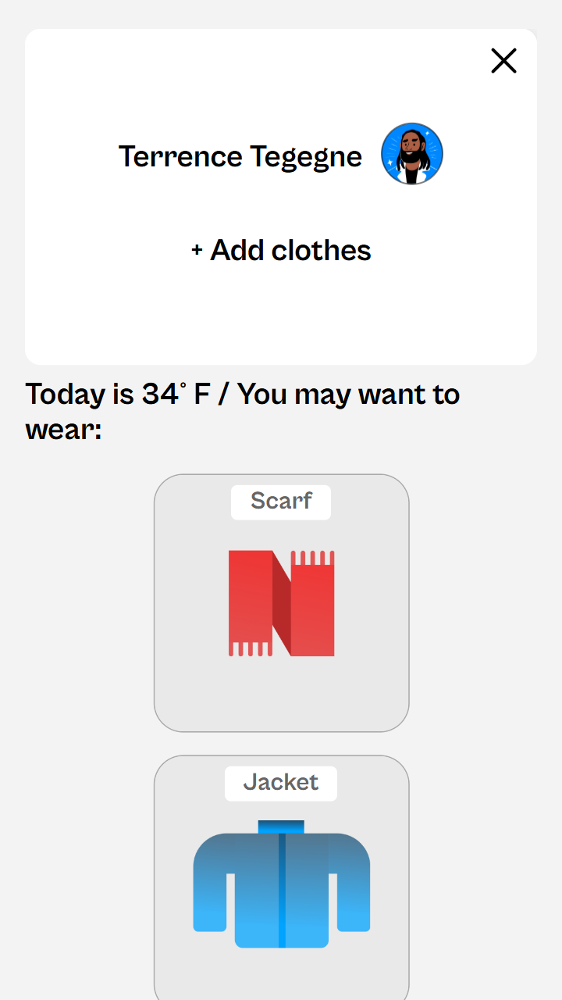
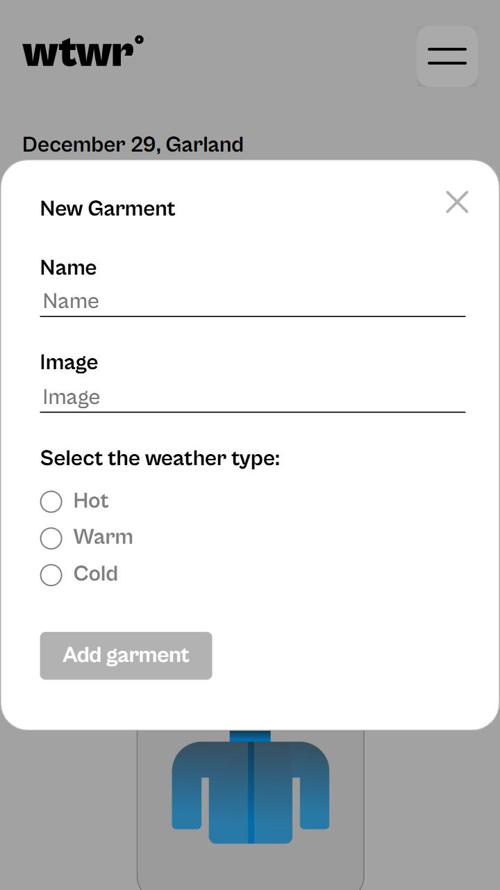
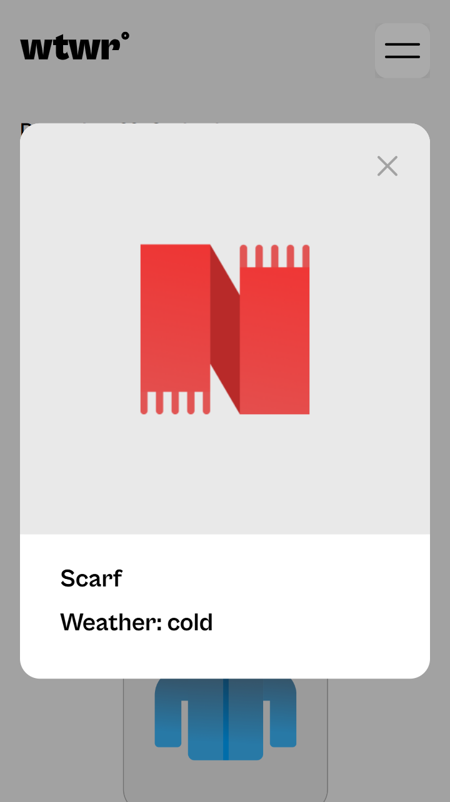

# WTWR

## Description:

A web application that suggests clothisg based on the weather

## Technologies

- React
- Vite
- JavaScript
- CSS
- HTML

# Images

# Demo Videos

### Youtube:

- [Part 1: The Frontend](https://youtu.be/FjNwaREWMWo)

- [Part 2: Mock server, Added features](https://youtu.be/cLBigjFQl4A)

### Google Drive:

- [Project 11: WTWR Part 2](https://drive.google.com/file/d/1bzrinxRrLOaGW-oyHfHTgyJOdz6pkshi/view?usp=drive_link)

# Deployed project

[See WTWR demo here](https://www.rose-ghaffari-wtwr.privatedns.org/)

# Backend

[WTWR Backend Repository](https://github.com/Rose-2357/se_project_express)
